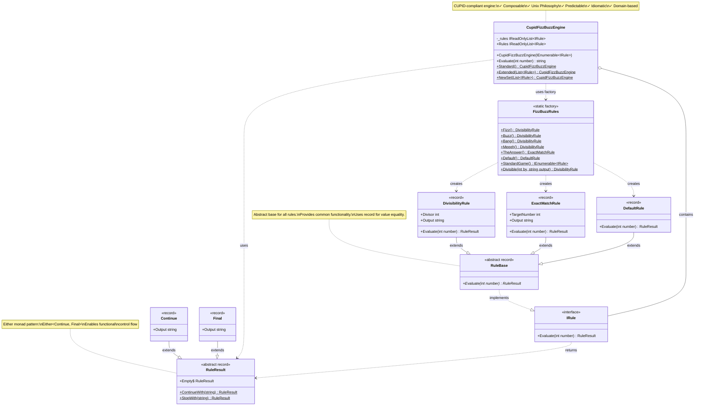

# FizzBuzz Engine - Class Diagram (UML)

## Architecture Overview

This diagram shows the CUPID-compliant functional architecture with the Either monad pattern.



## Key Design Patterns

### 1. **Either Monad Pattern** (`RuleResult`)
- **Purpose**: Functional control flow - rules can either continue or stop processing
- **Implementation**: Sealed record hierarchy with `Continue` and `Final` variants
- **Benefits**: Type-safe, pattern-matching friendly, eliminates null checks

### 2. **Strategy Pattern** (via `IRule`)
- **Purpose**: Each rule is a pluggable strategy for evaluating numbers
- **Implementation**: Interface with single method `Evaluate(int) -> RuleResult`
- **Benefits**: Easy to add new rules, CUPID-compliant composition

### 3. **Factory Pattern** (`FizzBuzzRules`)
- **Purpose**: Domain-specific language for creating rules
- **Implementation**: Static factory methods with expressive names
- **Benefits**: Clean API, hides implementation details, testable

### 4. **Template Method Pattern** (via `RuleBase`)
- **Purpose**: Provides common structure while allowing customization
- **Implementation**: Abstract record with abstract `Evaluate` method
- **Benefits**: Reduces duplication, enforces consistency

## Dependency Flow

```
User Code
    ↓
FizzBuzzRules (Factory)
    ↓ creates
Concrete Rules (DivisibilityRule, ExactMatchRule, DefaultRule)
    ↓ passed to
CupidFizzBuzzEngine
    ↓ evaluates via
IRule.Evaluate()
    ↓ returns
RuleResult (Continue or Final)
    ↓ pattern matched
Engine returns string
```

## CUPID Principles Applied

### 🏠 **Composable**
- Rules compose naturally through `IRule` interface
- Engine accepts any `IEnumerable<IRule>`
- No hidden dependencies or side effects

### 🔧 **Unix Philosophy**
- Each rule does ONE thing: evaluate a number
- Small, focused classes (12-15 lines each)
- Clear input → output contracts

### 🔮 **Predictable**
- Immutable records (value-based equality)
- Pure functions (same input → same output)
- Rule order = insertion order (no hidden priorities)

### 🆔 **Idiomatic**
- Modern C# features: records, pattern matching, expression-bodied members
- LINQ for functional transformations
- Nullability annotations

### 🚀 **Domain-Based**
- `FizzBuzzRules.Fizz()` speaks the domain language
- `RuleResult` models domain concept (continue vs final)
- Clear separation: domain (rules) vs infrastructure (engine)

## File Structure

```
FizzBuzz.Engine/
├── IRule.cs                    (Interface - contract)
├── RuleBase.cs                 (Abstract base - common functionality)
├── RuleResult.cs               (Either monad - functional control flow)
├── DivisibilityRule.cs         (Concrete rule - divisibility check)
├── ExactMatchRule.cs           (Concrete rule - exact match + stop)
├── DefaultRule.cs              (Concrete rule - fallback)
├── FizzBuzzRules.cs            (Factory - domain language)
└── CupidFizzBuzzEngine.cs      (Engine - orchestrator)
```

---

**Generated**: 2025-10-26  
**Architecture**: CUPID-compliant functional design with Either monad pattern
